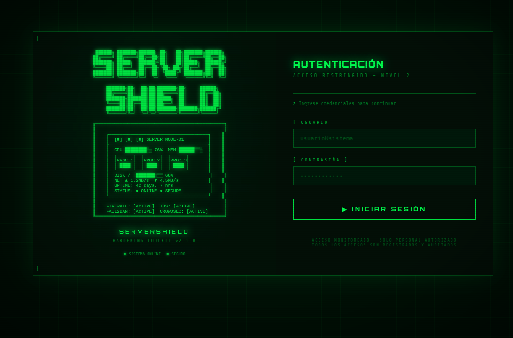
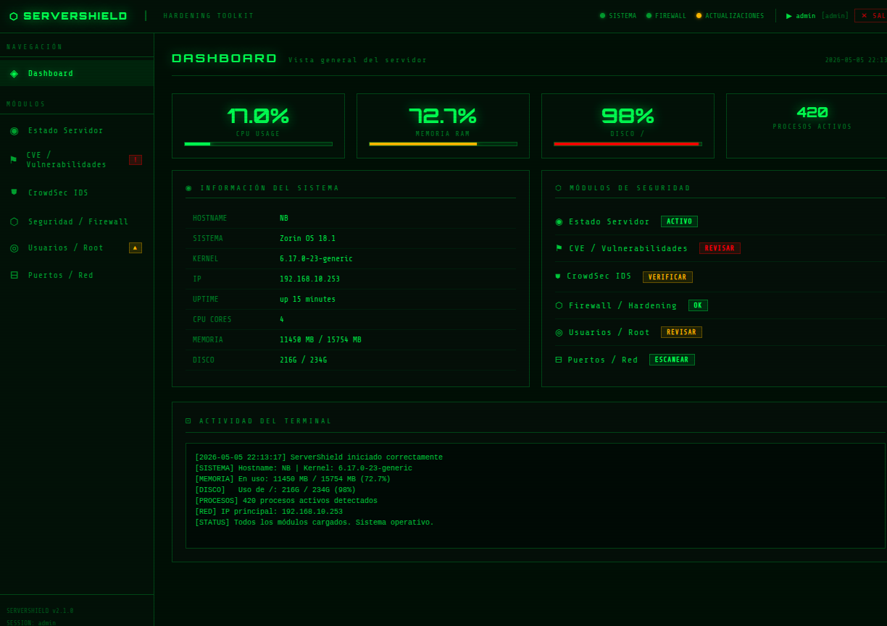
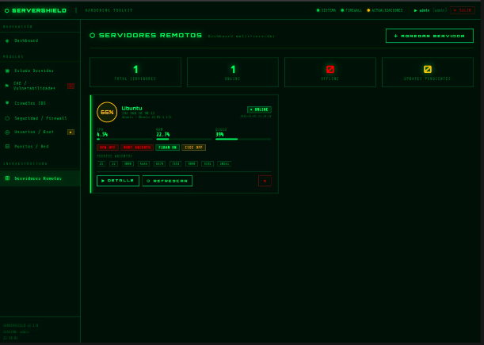
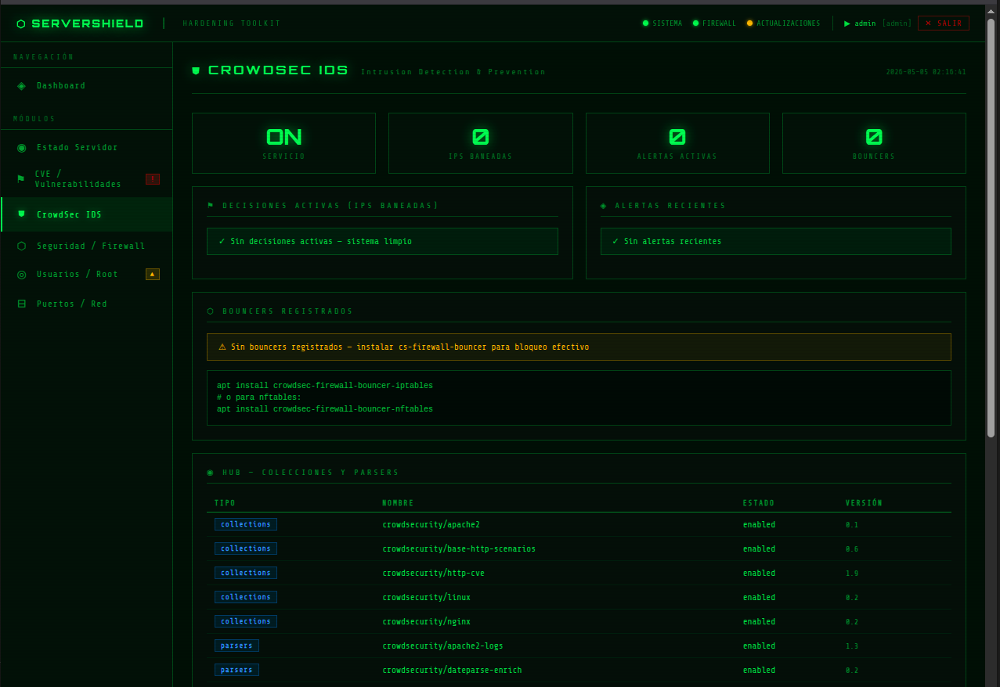

# ⬡ ServerShield — Hardening Toolkit

<div align="center">


**Herramienta web de hardening y monitoreo de seguridad para infraestructura híbrida.**
Linux · Windows · Switches · Firewalls · Multi-dispositivo vía SSH/WinRM. Easter egg incluido. 🟢

</div>

---

## 📸 Vista previa






---

## ✨ Características

### 🖥️ Análisis Local (servidor donde corre la app)
| Módulo | Descripción |
|--------|-------------|
| **Dashboard** | CPU, RAM, disco, uptime, procesos en tiempo real |
| **Estado Servidor** | Servicios systemd, top procesos, interfaces de red |
| **CVE / Vulnerabilidades** | Integración con NVD API (NIST), paquetes críticos, Lynis |
| **CrowdSec IDS** | IPs baneadas, alertas activas, bouncers, hub collections |
| **Seguridad / Firewall** | Hardening score, UFW, SSH, sysctl, AppArmor/SELinux |
| **Usuarios / Root** | Sudo, UID 0, /etc/shadow, grupos críticos, lastlog |
| **Puertos / Red** | Clasificación de riesgo, exposición pública, reglas firewall |

### 🌐 Servidores Remotos
| Tipo | Protocolo | Info recopilada |
|------|-----------|----------------|
| 🐧 **Linux** | SSH | CPU, RAM, disco, CVE, CrowdSec, usuarios, puertos, hardening completo |
| 🪟 **Windows** | WinRM | CPU, RAM, disco, Defender, Firewall, UAC, SMBv1, RDP, Windows Update |

### 🔀 Switches / Red
| Vendor | Protocolo | Capacidades |
|--------|-----------|-------------|
| 🔵 **Cisco** IOS/IOS-XE | SSH | VLANs, interfaces, ACLs, port security, STP |
| 🟢 **HP / Aruba** | SSH | VLANs, interfaces, usuarios, ACLs |
| 🟡 **MikroTik** RouterOS | SSH | Interfaces, VLANs, usuarios, firewall rules |
| 🔴 **Juniper** JunOS | SSH | Interfaces, VLANs, firewall, usuarios |
| 🟠 **Fortinet** FortiGate/FortiSwitch | SSH | Interfaces, políticas, usuarios admin, NTP, logging |
| 🔌 **Dispositivos Legacy** | Telnet | Cisco Catalyst 2960 y similares |

### 🖥️ Terminal Web SSH/Telnet
- Terminal interactiva en el navegador con xterm.js
- Conexión en tiempo real vía WebSocket
- Soporte SSH (Linux, switches) y Telnet (dispositivos legacy)
- Botones rápidos: updates, stats, puertos
- Solo accesible para usuario admin

**Vendors de switch soportados:** Cisco IOS/IOS-XE · HP/Aruba · MikroTik · Juniper

### ⚙️ Gestión y Configuración
- **Panel de usuarios** — agregar, eliminar, cambiar contraseñas (hash bcrypt)
- **Roles** — Admin (acceso total) y Auditor (solo visualización)
- **Panel de actualizaciones** — verificar y aplicar `git pull` desde la UI
- **Configuración de puerto** y parámetros de la app desde la interfaz

### 🎨 Extras
- Login de **dos columnas** con ASCII art del servidor
- **Easter egg Matrix** (`--matrix-mode`) con lluvia de katakana y boot sequence
- Interfaz 100% estilo terminal — verde fosforescente / negro
- Caché inteligente + consultas en paralelo para servidores remotos
- Corre como **servicio systemd** con arranque automático

---

## 🚀 Instalación rápida

```bash
# 1. Clonar el repositorio
git clone https://github.com/N1x-afl/servershield.git
cd servershield

# 2. Crear entorno virtual
python3 -m venv venv
source venv/bin/activate

# 3. Instalar dependencias
pip install -r requirements.txt

# 4. Ejecutar con privilegios completos (recomendado)
sudo venv/bin/python3 app.py
```

Abrí el navegador en **http://localhost:5000**

---

## 🔐 Credenciales por defecto

| Usuario | Contraseña | Rol |
|---------|-----------|-----|
| `admin` | `Adm1n@Shield2024` | Administrador — acceso total |
| `auditor` | `Aud1t@2024` | Solo visualización |

> ⚠️ **Cambiar las contraseñas** desde **Configuración → Contraseña** antes de usar en producción.
> Las contraseñas se almacenan con hash bcrypt en `config.json` (no incluido en el repo).

---

## 🟢 Easter Egg — Matrix Mode

```bash
sudo venv/bin/python3 app.py --matrix-mode
sudo venv/bin/python3 app.py --matrix-mode --matrix-duration 10
sudo venv/bin/python3 app.py --port 8080
```

---

## 🌐 Agregar Servidores Remotos

### 🐧 Linux (SSH)
1. Ir a **Infraestructura → Servidores Remotos → Agregar Servidor**
2. Seleccionar **🐧 Linux (SSH)**
3. Ingresar IP, puerto 22, usuario y contraseña o clave SSH

### 🪟 Windows (WinRM)
Habilitar WinRM en el equipo Windows (como Administrador):
```powershell
Enable-PSRemoting -Force
Set-Item WSMan:\localhost\Client\TrustedHosts -Value "*" -Force
```
En ServerShield seleccionar **🪟 Windows (WinRM)** — puerto 5985 automático.

### 🔀 Switch/Router (SSH)
Habilitar SSH en el switch:
```
# Cisco IOS:
ip ssh version 2
line vty 0 4
 transport input ssh
 login local
```
En ServerShield seleccionar **🔀 Switch/Router (SSH)** — detecta el vendor automáticamente.

### Autenticación con clave SSH (Linux/Switch)
```bash
ssh-keygen -t rsa -b 4096 -C "servershield"
ssh-copy-id usuario@IP-del-servidor
```

---

## ⬆️ Actualizaciones desde la UI

1. Ir a **Sistema → Actualizaciones**
2. La app verifica automáticamente si hay commits nuevos en GitHub
3. Clic en **Aplicar Actualización** para hacer `git pull`
4. Reiniciar la app para cargar los cambios:
```bash
sudo systemctl restart servershield
# o: Ctrl+C y volver a lanzar
```

---

## 🛠️ Instalación como servicio (arranque automático)

```bash
sudo mv servershield /opt/servershield
cd /opt/servershield
sudo python3 -m venv venv
sudo venv/bin/pip install -r requirements.txt
sudo nano /etc/systemd/system/servershield.service
```

```ini
[Unit]
Description=ServerShield Hardening Toolkit
After=network.target

[Service]
Type=simple
User=root
WorkingDirectory=/opt/servershield
ExecStart=/opt/servershield/venv/bin/python3 /opt/servershield/app.py
Restart=always

[Install]
WantedBy=multi-user.target
```

```bash
sudo systemctl daemon-reload
sudo systemctl enable servershield
sudo systemctl start servershield
```

---

## 📋 Requisitos

```
flask>=3.0.0
paramiko>=3.0.0
pywinrm>=0.4.3
bcrypt>=4.0.0
```

```bash
sudo apt install python3-venv python3-pip -y
```

---

## 📁 Estructura del proyecto

```
servershield/
├── app.py                    # Aplicación Flask principal
├── matrix_mode.py            # Easter egg Matrix + argparse
├── remote_cache.py           # Caché + consultas paralelas
├── requirements.txt
├── .gitignore
├── modules/
│   ├── system_info.py        # Métricas locales
│   ├── security_check.py     # Hardening local
│   ├── cve_check.py          # CVEs y NVD API
│   ├── crowdsec_mod.py       # CrowdSec IDS local
│   ├── users_mod.py          # Usuarios locales
│   ├── ports_mod.py          # Puertos locales
│   ├── remote_ssh.py         # Análisis remoto Linux
│   ├── windows_remote.py     # Análisis remoto Windows
│   ├── switch_remote.py      # Análisis remoto Switch/Router
│   ├── updater.py            # Auto-actualización git
│   └── config_manager.py     # Gestión usuarios y config
└── templates/
    ├── login.html
    ├── base.html
    ├── dashboard.html
    ├── status.html
    ├── cve.html
    ├── crowdsec.html
    ├── security.html
    ├── users.html
    ├── ports.html
    ├── servers.html
    ├── server_detail.html
    ├── settings.html
    └── updates.html
```

---

## 🤝 Contribuir

1. Fork del repositorio
2. `git checkout -b feature/nueva-funcionalidad`
3. `git commit -m 'feat: descripción'`
4. `git push origin feature/nueva-funcionalidad`
5. Abrir Pull Request

### Ideas para contribuir
- [ ] Alertas por email/Telegram cuando un servidor cae
- [ ] Gráficos históricos de CPU/RAM
- [ ] Autenticación con 2FA
- [ ] Exportar reportes en PDF desde la web
- [ ] Soporte SNMP para switches sin SSH
- [ ] Dashboard de métricas comparativas entre servidores

---

## 📄 Licencia

MIT License — libre para usar, modificar y distribuir.
Si lo usás en producción o lo mejorás, una ⭐ en el repo es bienvenida.

---

<div align="center">

**Desarrollado con Python, Flask y demasiado café ☕**
*"El que no monitorea, no administra."*

[⭐ Star en GitHub](https://github.com/N1x-afl/servershield) · [🐛 Reportar issue](https://github.com/N1x-afl/servershield/issues) · [🔀 Pull Requests](https://github.com/N1x-afl/servershield/pulls)

</div>
